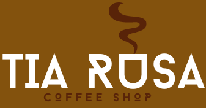
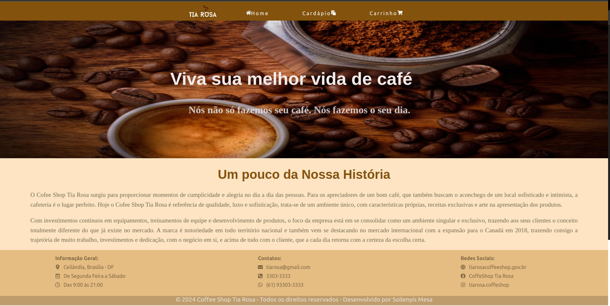
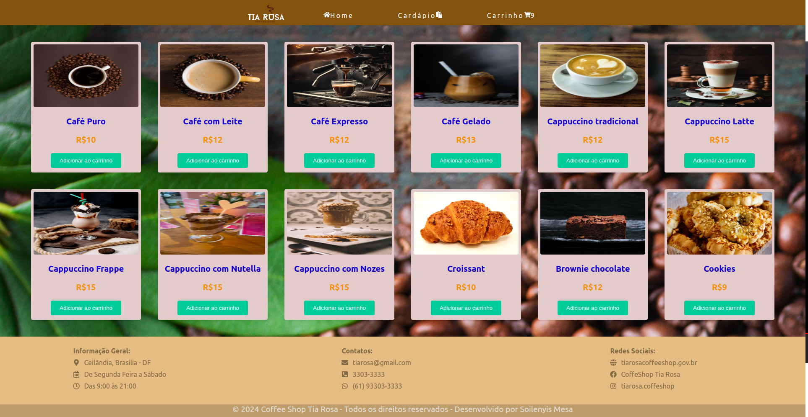
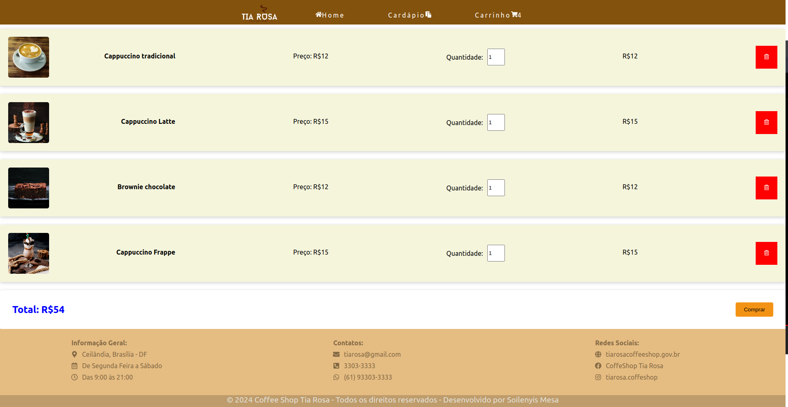
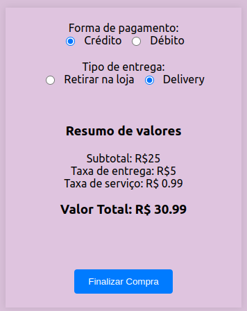

# Coffee Shop Tia Rosa 

### Relatório do Projeto Coffee Shop Tia Rosa

O projeto Coffee Shop Tia Rosa foi desenvolvido com o objetivo de melhorar a qualidade do serviço aos clientes, reduzir custos e abarcar maior público com a introdução do delivery e a divulgação na internet através das redes sociais.

### Estrutura do Código
O código do projeto é estruturado da seguinte maneira:

Componentes: Esta seção do código contém todos os componentes React usados para construir a interface do usuário. Cada componente tem sua própria pasta, que inclui o arquivo do componente e o arquivo CSS associado. Eles serão reutilizados

Pages: Nesta seção são chamados os componentes para conformar a interface das páginas que contém nosso aplicativo

Context: Esta seção do código contém o Contexto do Carrinho, que é usado para gerenciar o estado do carrinho de compras em toda a aplicação.

CSS: Esta seção do código contém todos os estilos CSS usados para estilizar os componentes.

### Principais Ferramentas Utilizadas
React: Utilizamos o React para construir a interface do usuário. O React nos permite criar componentes reutilizáveis, o que torna o código mais eficiente e fácil de manter.

React Router: Utilizamos o React Router para gerenciar a navegação entre as diferentes páginas da aplicação.

React Icons: Utilizamos a biblioteca React Icons para adicionar ícones à nossa aplicação.

JavaScript: Utilizamos JavaScript para criar a base de dados dos produtos. O JavaScript nos permite criar estruturas de dados complexas, como o array de objetos que estamos usando para representar nossos produtos.

Local Storage: Utilizamos o Local Storage do navegador para armazenar os itens do carrinho de compras. Isso permite que os itens do carrinho sejam persistidos mesmo quando a página é recarregada.

### App.js

```javascript
import { BrowserRouter as Router, Routes, Route } from 'react-router-dom';
import { CarrinhoProvider } from './Context/CarrinhoContext';

import PaginaPrincipal from './pages/PaginaPrincipal';
import Cardapio from './pages/Cardapio';
import Carrinho from './pages/Carrinho';
import Compras from './pages/Compras';


function App() {
  return (
    <CarrinhoProvider>
      <Router>
        <Routes>
          <Route path='/' element={<PaginaPrincipal />} />
          <Route path='/cardapio' element={<Cardapio />} />
          <Route path='/carrinho' element={<Carrinho />} />
          <Route path='/compras' element={<Compras /> } />
        </Routes>
      </Router>
    </CarrinhoProvider>

  );
}

export default App;
```
O arquivo App.js é o ponto de entrada do nosso aplicativo React. Ele define a estrutura geral do aplicativo e as rotas para as diferentes páginas.

Primeiro, importamos os módulos necessários para o nosso aplicativo. Isso inclui o BrowserRouter (renomeado para Router), Routes e Route do pacote react-router-dom, que são usados para configurar o roteamento do nosso aplicativo. Também importamos o CarrinhoProvider do nosso contexto do carrinho, que é usado para fornecer o estado do carrinho para todos os componentes do nosso aplicativo.

Em seguida, importamos os componentes das nossas páginas: PaginaPrincipal, Cardapio, Carrinho e Compras.

Dentro da função App, retornamos o JSX que define a estrutura do nosso aplicativo. O CarrinhoProvider é usado para envolver todo o nosso aplicativo, garantindo que o estado do carrinho esteja disponível em todos os lugares.

Dentro do CarrinhoProvider, temos o Router que envolve o componente Routes. O Routes é onde definimos nossas rotas. Cada Route representa uma página diferente no nosso aplicativo e tem um path que corresponde ao caminho na URL. O atributo element de cada Route é o componente que será renderizado quando a rota correspondente for acessada.


### arquivo produtosdb.js

```javascript
const cafes = [
    {
        id: 1, 
        nome: "Café Puro", 
        preco: 10.00, 
        imagem: "./imagens/cafe-puro.jpg", 
    },
    {
        id: 2, 
        nome: "Café com Leite", 
        preco: 12.00, 
        imagem: "./imagens/cafe-leite.jpg", 
    },
    {
        id: 3, 
        nome: "Café Expresso", 
        preco: 12.00, 
        imagem: "./imagens/cafe-expresso.jpg", 
    },
    {
        id: 4, 
        nome: "Café Gelado", 
        preco: 13.00, 
        imagem: "./imagens/cafe-gelado.jpg", 
    },
    {
        id: 5, 
        nome: "Cappuccino tradicional", 
        preco: 12.00, 
        imagem: "./imagens/cappuccino-trad.jpg",
    },
    {
        id: 6, 
        nome: "Cappuccino Latte", 
        preco: 15.00, 
        imagem: "./imagens/cap-latte.jpg", 
    },
    {
        id: 7, 
        nome: "Cappuccino Frappe", 
        preco: 15.00, 
        imagem: "./imagens/cap-frappe.jpg", 
    },
    {
        id: 8, 
        nome: "Cappuccino com Nutella", 
        preco: 15.00, 
        imagem: "./imagens/cap-nutella.jpeg", 
    },
    {
        id: 9, 
        nome: " Cappuccino com Nozes", 
        preco: 15.00, 
        imagem: "./imagens/milk-nozes.jpg", 
    },
    {
        id: 10, 
        nome: "Croissant", 
        preco: 10.00, 
        imagem: "./imagens/croissant-trad.jpg", 
    },
    {
        id: 11, 
        nome: "Brownie chocolate", 
        preco: 12.00, 
        imagem: "./imagens/brownie.jpg", 
    },
    {
        id: 12, 
        nome: "Cookies", 
        preco: 9.00, 
        imagem: "./imagens/cookies.jpg", 
    },
    {
        id: 13, 
        nome: "Panqueca", 
        preco: 9.00, 
        imagem: "./imagens/panqueca.jpg", 
    },
    {
        id: 14, 
        nome: "Pão de queijo", 
        preco: 6.00, 
        imagem: "./imagens/pao-queijo.jpg", 
    },
    {
        id: 15, 
        nome: "Pudim de Leite", 
        preco: 7.00, 
        imagem: "./imagens/pudim.jpg", 
    }, 
    {
        id: 16, 
        descricao: "Coxinha frango", 
        preco: 10.00, 
        imagem: "./imagens/coxinha.jpg", 
    },
];

export default cafes;
```
 Este arquivo é uma simulação de uma base de dados dos produtos oferecidos pelo Coffee Shop Tia Rosa. Ele contém um array de objetos, onde cada objeto representa um produto individual.

Cada produto é representado por um objeto com as seguintes propriedades:
- id: Um número único que identifica o produto. Este é um campo importante que é usado para rastrear produtos individuais, especialmente quando estamos manipulando itens no carrinho de compras.

- nome: O nome do produto. Este é o nome que será exibido na interface do usuário.

- preco: O preço do produto. Este valor será usado ao calcular o total do carrinho de compras.

- imagem: O caminho para a imagem do produto. Este caminho será usado para exibir a imagem do produto na interface do usuário.

## Context
### CarrinhoContext.js
```javascript
import React, { createContext, useState } from 'react';

export const CarrinhoContext = createContext();

export const CarrinhoProvider = ({ children }) => {
    const [carrinhoItem, setCarrinhoItem] = useState([]);
    const [qtdItemCarrinho, setQtdItemCarrinho] = useState(0);

    return (
        <CarrinhoContext.Provider value={{carrinhoItem, setCarrinhoItem, qtdItemCarrinho, setQtdItemCarrinho}}>
            {children}
        </CarrinhoContext.Provider>
    );
};
```
O código acima é parte de um arquivo JavaScript que usa a biblioteca React. Ele define um contexto chamado CarrinhoContext que é usado para compartilhar o estado do carrinho de compras entre diferentes componentes da aplicação.

Primeiro, o React e o hook createContext são importados do pacote 'react'. Em seguida, CarrinhoContext é criado chamando createContext(). Este contexto será usado para permitir que os componentes se inscrevam para mudanças no estado do carrinho.

O componente CarrinhoProvider é então definido. Este componente é um provedor de contexto que envolve outros componentes e permite que eles acessem o estado do carrinho e a função para atualizar esse estado. Dentro deste componente, o estado do carrinho é inicializado usando o hook useState. O estado inicial do carrinho é um array vazio, e a quantidade inicial de itens no carrinho é 0.

O componente CarrinhoProvider retorna o componente CarrinhoContext.Provider, que recebe um objeto como valor. Este objeto contém o estado do carrinho (carrinhoItem), a função para atualizar o estado do carrinho (setCarrinhoItem), a quantidade de itens no carrinho (qtdItemCarrinho) e a função para atualizar a quantidade de itens no carrinho (setQtdItemCarrinho).

Os componentes filhos de CarrinhoProvider são renderizados dentro de CarrinhoContext.Provider, o que significa que eles terão acesso ao estado do carrinho e às funções para atualizar esse estado.

#  Componentes: 

## componente Banner:

### Banner.js
```javascript
import React, { useContext } from 'react';
import { CarrinhoContext } from '../../Context/CarrinhoContext';
import { Link } from 'react-router-dom';
import { FaHome, FaPaste, FaShoppingCart } from 'react-icons/fa';
import './Banner.css'

const Banner = () => {
    const { qtdItemCarrinho } = useContext(CarrinhoContext);
    return (
        <header className='cabecalho'>
            <Link className='logo' to="/">
                
            </Link> 
            <nav> 
                <ul className='menu-lista'>
                    <li className='item-menu'>
                        <Link className='link-menu' to="/">
                            <FaHome />
                            Home
                        </Link>
                    </li>
                    <li className='item-menu'>
                        <Link className='link-menu' to="/cardapio">
                            Cardápio
                            <FaPaste />                           
                        </Link>
                    </li>
                    <li className='item-menu'>
                        <Link className='link-menu' to="/carrinho">
                            Carrinho
                            <FaShoppingCart />
                            {qtdItemCarrinho > 0 && <span className='badge'>{qtdItemCarrinho}</span>}
                        </Link>
                    </li>
                </ul>
            </nav>         
        </header>
    );
}

export default Banner
```
O arquivo Banner.js define o componente Banner, que é usado para renderizar o cabeçalho do nosso aplicativo. Este cabeçalho inclui a logo do Coffee Shop Tia Rosa e a navegação principal que permite se deslocar para as páginas: Home, Cardápio e Carrinho. Ele vai ser usado em diferentes páginas.

## Banner.css
```css
.cabecalho { 
    background-color: #83520d;
    height: 60px;
    display: flex;
    align-items: center;
    letter-spacing: 0.20em;
    justify-content: center;
    padding: 0 20px;
    box-sizing: border-box;
}

.logo img {
    width: 5.5em;
    margin-top: 10px;
}

.menu-lista {
    display: flex;
    justify-content: flex-end;
    flex-wrap: wrap;
}

.item-menu {
    display: inline-block;
    margin: 0 30px; 
    margin-top: 12px;
}

.link-menu {
    display: inline-block;
    padding: 1.86em 1.42em;
    color: white;
    text-decoration: none;
}
```
Arquivo Banner.css contém os estilos CSS para o componente Banner, garantindo que ele tenha a aparência desejada e funcione corretamente em diferentes tamanhos de tela.

## componente Body

### Body.js
```javascript
import './Body.css'

const Body = () => {
    return (
        <body className='conteudo-body'>
            <div className='body-banner'>
                <h1 className='body-banner-h1'>Viva sua melhor vida de café</h1>
                <h5 className='body-banner-h5'>Nós não só fazemos seu café. Nós fazemos o seu dia.</h5>
                
            </div>
            <div className='body-sobre'>
                <h1 className='body-sobre-titulo'>
                    Um pouco da Nossa História
                </h1>
                <p className='body-sobre-text'>
                    O Cofee Shop Tia Rosa surgiu para proporcionar momentos de cumplicidade e alegria no dia
                    a dia das pessoas. Para os apreciadores de um bom café, que também buscam o aconchego de
                    um local sofisticado e intimista, a cafeteria é o lugar perfeito. Hoje o Cofee Shop Tia
                    Rosa é referência de qualidade, luxo e sofisticação, trata-se de um ambiente único, com
                    características próprias, receitas exclusivas e arte na apresentação dos produtos.
                </p>
                <p className='body-sobre-text'>
                    Com investimentos contínuos em equipamentos, treinamentos de equipe e desenvolvimento de
                    produtos, o foco da empresa está em se consolidar como um ambiente singular e exclusivo,
                    trazendo aos seus clientes o conceito totalmente diferente do que já existe no mercado.
                    A marca é notoriedade em todo território nacional e também vem se destacando no mercado
                    internacional com a expansão para o Canadá em 2018, trazendo consigo a trajetória de muito
                    trabalho, investimentos e dedicação, com o negócio em si, e acima de tudo com o cliente, 
                    que a cada dia retorna com a certeza da escolha certa.
                </p>
            </div>
        </body>
    )
}

export default Body
```
arquivo Body.js define o componente Body, que é usado para renderizar o corpo da nossa página de inicio do nosso aplicativo. Contém uma imagem que define o nosso parincipal produto de venda que é o café, depois contém uma seção que descreve um pouco do conceito e da historia da Coffee Shop Tia Rosa.

### Body.css
```css
.conteudo-body {
    width: 100%;
    height: 100%;
    margin: 0;
    padding: 0;
    display: block;
    background-color: bisque;
}

.body-banner {
    text-align: center;
    display:block;
}

.body-banner-h1 {
    color: #f1ebeb;
    font-family: Arial, Helvetica, sans-serif;
    font-size: 3.5em;
    position: absolute;
    top: 18%;
    left: 28%;
}
.body-banner-h5 {
    color: #e9e2e2d8;
    font-family:'Times New Roman', Times, serif;
    font-size: 2.0em;
    position: absolute;
    top: 28%;
    left: 31%;
}

.body-banner-img {
    width: 100%;
    height: 45vh;
}

.body-sobre {
    width: 100%;
    height: 27vh;
    text-align: justify; 
}
.body-sobre-titulo {
    color: #83520d;
    font-family: 'Open Sans', sans-serif;
    font-size: 2.5em;
    text-align: center; 
}

.body-sobre-text {
    color: #776a4d;
    font-family: 'Times New Roman', Times, serif;
    font-size: 1.2em;
    width: 90%;
    word-wrap: break-word;
    line-height: 1.6;
    margin-left: 5%;
}
```
Arquivo Body.css contém os estilos CSS que serão aplicados ao componente Body.

## componente Rodape

### Rodape.js
```javascript
import './Rodape.css';

import {FaMapMarkerAlt, FaRegCalendarAlt, FaRegClock, FaGlobe, FaEnvelope} from 'react-icons/fa';
import {FaPhoneSquareAlt, FaWhatsapp, FaFacebook, FaInstagram } from 'react-icons/fa';

const Rodape = () => {
    return(
        <footer>
            <div className="container-footer">
                <ul className='footer-lista'>
                    <li className='titulo'>Informação Geral:</li>
                    <li>
                        <FaMapMarkerAlt className="icone-fa"/>
                        <span>Ceilândia, Brasília - DF</span>
                    </li>
                    <li>
                        <FaRegCalendarAlt className="icone-fa"/>
                        <span>De Segunda Feira a Sábado</span>
                    </li>
                    <li>
                        <FaRegClock className="icone-fa"/>
                        <span>Das 9:00 às 21:00</span>
                    </li>
                </ul>

                <ul className='footer-lista'>
                    <li className='titulo'>Contatos:</li>
                    <li>
                        <FaEnvelope className="icone-fa"/>
                        <span>tiarosa@gmail.com</span>
                    </li>
                    <li>
                        <FaPhoneSquareAlt className="icone-fa"/>
                        <span>3303-3333</span>
                    </li>
                    <li>
                        <FaWhatsapp className="icone-fa"/>
                        <span>(61) 93303-3333</span>
                    </li>   
                </ul> 

                <ul className='footer-lista'>
                    <li className='titulo'>Redes Sociais:</li>
                    <li>
                        <FaGlobe className="icone-fa"/>
                        <span>tiarosacoffeeshop.gov.br</span>
                    </li>
                    <li>
                        <FaFacebook className="icone-fa"/>
                        <span>CoffeShop Tia Rosa</span>
                    </li> 
                    <li>
                        <FaInstagram className="icone-fa"/>
                        <span>tiarosa.coffeshop</span>    
                    </li>  
                </ul>
            </div>
            <section className='copyright'>
                <span>
                    &copy; 2024 Coffee Shop Tia Rosa - Todos os direitos reservados - Desenvolvido por Soilenyis Mesa 
                </span>
            </section>  
        </footer>
    )
}

export default Rodape 
```
Arquivo Rodape.js é parte de um componente React que parece estar renderizando a seção de rodapé de um site. O rodapé é dividido em três seções principais, cada uma contendo uma lista de informações.

A primeira lista parece estar fornecendo informações sobre a localização e o horário de funcionamento de um estabelecimento. Cada item da lista (li) contém um ícone (usando o pacote react-icons/fa) e um texto (span) que fornece detalhes específicos.

A segunda lista fornece informações de contato, incluindo um endereço de e-mail, um número de telefone e um número de WhatsApp. Novamente, cada item da lista tem um ícone correspondente e um texto com os detalhes.

A terceira lista contém links para as redes sociais e o site do estabelecimento. Cada item da lista tem um ícone que representa a plataforma de mídia social e um texto com o nome do perfil ou o URL do site.

Finalmente, há uma seção de direitos autorais que exibe uma mensagem de direitos autorais.

## Rodape.css
```css
.container-footer {
    display: flex;
    justify-content: space-between;
    align-items: center;
    background-color: #e5bc82;
    width: 100%;
    height: 15vh;
}

.footer-lista {
    flex: 1;
    margin-right: 7%;
    margin-left: 7%;
    list-style: none;
}
.footer-lista li {
    display: flex;
    align-items: center;
    margin-bottom: 10px;
}

.footer-lista li span {
    margin-left: 10px;
    color: #836944;
}

.footer-lista .titulo {
    font-weight: bold;
    color: #836944;
}

.footer-lista .titulo::after {
    margin-right: 5px;
}

.icone-fa{
    color: #836944;

}
.copyright {
    justify-content: space-evenly;
    background-color: #be9c6b;
    height: 30px;
    text-align: center;
}

.copyright span {
    font-size: 1.2em;
    color: #e4e1db;
}
```
O arquivo Rodape.css define os estilos para o componente Rodape

## componente CardapioProdutos

### CardapioProdutos.js
```javascript
import { useContext } from "react";
import './CardapioProdutos.css'
import cafes from "../../produtosdb"
import { CarrinhoContext } from "../../Context/CarrinhoContext";

const CardapioProdutos = () => {
    const {carrinhoItem, setCarrinhoItem, setQtdItemCarrinho} = useContext(CarrinhoContext);


    const handleAdicionarCarrinho = (id) => {
        const cafe = cafes.find(cafe => cafe.id === id)
        const itemExistente = carrinhoItem.find(item => item.produto.id === id);

        if (itemExistente) {
            const carrinhoAtualizado = carrinhoItem.map(item => 
                item.produto.id === id ? {...item, quantity: item.quantity + 1} : item
            );
            setCarrinhoItem(carrinhoAtualizado);
        } else {
            const carrinhoProps = {
                produto: cafe,
                quantity: 1,
            };
            const novoItemCarrinho = [...carrinhoItem, carrinhoProps];
            setCarrinhoItem(novoItemCarrinho);
        }  
        setQtdItemCarrinho(prevQuantidade => prevQuantidade + 1);
}
    return(
        <div>
            <div className="container-cardapio">
                <div className="produto">
                    {cafes.map(cafe => ( 
                        <div key={cafe.id} className="produto-card">
                            
                            <div className="produto-info">
                                <h2 className="produto-nome">{cafe.nome}</h2>
                                <p className="produto-preco">R${cafe.preco}</p>
                                <button className="botao-carrinho" onClick={() => handleAdicionarCarrinho(cafe.id)}>
                                  Adicionar ao carrinho
                                </button>
                            </div>
                        </div>    
                    ))}
                </div>    
            </div>

        </div> 
    )
}
export default CardapioProdutos 
```
Este componente é responsável por renderizar uma lista de produtos (cafés) e gerenciar a adição desses produtos a um carrinho de compras.

Primeiro, o arquivo CSS CardapioProdutos.css e o array cafes do arquivo produtosdb são importados. O cafes é um array de objetos, onde cada objeto representa um café com propriedades como id, nome, preco e imagem.

O contexto CarrinhoContext também é importado. Este contexto provavelmente fornece funções e variáveis que permitem gerenciar um carrinho de compras em toda a aplicação. As funções setCarrinhoItem e setQtdItemCarrinho, bem como a variável carrinhoItem, são extraídas desse contexto usando o hook useContext.

A função handleAdicionarCarrinho é definida dentro do componente. Esta função é responsável por adicionar itens ao carrinho de compras. Ela recebe um id como argumento, que é usado para identificar o café que deve ser adicionado ao carrinho.

Dentro da função handleAdicionarCarrinho, primeiro é verificado se o item já existe no carrinho. Se o item existir, a quantidade desse item é aumentada em 1. Se o item não existir, um novo objeto é criado com o produto e a quantidade, e esse objeto é adicionado ao carrinho.

Finalmente, o componente retorna um JSX que renderiza a lista de produtos. Cada produto é renderizado com uma imagem, nome, preço e um botão que, quando clicado, adiciona o produto ao carrinho.

### CardapioProdutos.css
```css
.container-cardapio{
    background-image: url("../../../public/imagens/logo-cardapio1.jpg");
    width: 100%;
    padding: 40px;
    box-sizing: border-box;
}

.produto{
    display: flex;
    flex-wrap: wrap;
    gap: 40px;
    justify-content: center;
}

.produto-card{
    background-color: #e4cbcb;
    width: 250px;
    height: 300px;
    padding: 6px;
    border-radius: 4px;
    overflow: hidden;
    box-shadow: 0 2px 5px rgba(0, 0, 0, 0.1);
}

.produto-card:hover {
    outline: 1px solid var(--blue);
    transform: scale(1.1, 1.1);
    cursor: pointer;
}

.produto-imagem {
    width: 100%;
    height: 50%;
    display: flex;
    border-radius: 4px;
}
.produto-info{
    padding: 5px;
    text-align: center;
}
.produto-nome {
    font-size: 20px;
    color: rgb(20, 0, 204);
}
.produto-preco {
    color: #f39315;
    font-size: 20px;
    font-weight: bold;
}

.botao-carrinho {
    background-color: #0c9;
    color: #fff;
    border: none;
    padding: 10px 20px;
    border-radius: 4px;
    cursor: pointer;
    transition: background-color 0.3s ease;
    width: 70%;
  }
  
  .botao-carrinho:hover {
    background-color: rgb(99, 230, 11);
  }
```
O código acima é um arquivo CSS que define os estilos para o componente CardapioProdutos

## componente CarrinhoItems

### CarrinhoItems.js
```javascript

import React, { useContext, useEffect } from "react";
import { CarrinhoContext } from "../../Context/CarrinhoContext";
import { FaRegTrashAlt } from 'react-icons/fa';
import './CarrinhoItems.css'
import { Link } from "react-router-dom";

const CarrinhoItems = () => {
    const {carrinhoItem, setCarrinhoItem, setQtdItemCarrinho} = useContext(CarrinhoContext);     

        useEffect(() => { 
            const carrinhoData = localStorage.getItem('carrinho');
            if(carrinhoData){
                setCarrinhoItem(JSON.parse(carrinhoData))
            }     
        }, [setCarrinhoItem]);

        useEffect(() => {
            localStorage.setItem('carrinho', JSON.stringify(carrinhoItem));
        }, [carrinhoItem])

    const handleRemoverCarrinho = (id) => {
        const CarrinhoRemove = carrinhoItem.filter(item => item.produto.id !== id);
        setCarrinhoItem(CarrinhoRemove);
        setQtdItemCarrinho(prevQuantidade => prevQuantidade - 1);

    }

    const handleAlterarQuantidade = (id, quantidade) => {
        const novaLista = carrinhoItem.map(item => {
            if (item.produto.id === id) {
                return { ...item, quantity: Number(quantidade) };
            } else {
                return item;
            }
        });
        setCarrinhoItem(novaLista);
    }

    return (
        <div className="container-carrinho">
            <div className="carrinho">
                {carrinhoItem.map(item => ( 
                    <div key={item.produto.id} className="carrinho-card">
                        
                        <div className="carrinho-info">
                            <p className="carrinho-nome">{item.produto.nome}</p>
                            <p className="carrinho-preco">Preço: R${item.produto.preco}</p>
                            <div className='carrinho-quantity'>
                                <label>Quantidade: </label>
                                <input
                                    type="number"
                                    min="1"
                                    value={item.quantity}
                                    onChange={(e) => handleAlterarQuantidade(item.produto.id, e.target.value)}
                                />
                            </div>
                            <p>R${item.quantity * item.produto.preco}</p>
                            <button className='botao-remover' onClick={() => handleRemoverCarrinho(item.produto.id)}>
                                <FaRegTrashAlt />
                            </button>
                        </div>  
                    </div>                 
                ))}
                {carrinhoItem.length > 0 && (
                    <div className='total-comprar'>
                        <h2>
                            Total: R${carrinhoItem.reduce((total, item) => total + (item.quantity * item.produto.preco), 0)}
                        </h2>
                        <Link to="/compras">
                            <button>Comprar</button>
                        </Link>  
                    </div>
                )}
            </div>    
        </div>
    )
}

export default CarrinhoItems
```
O código acima é um componente React chamado CarrinhoItems. Este componente é responsável por renderizar os itens no carrinho de compras e gerenciar a remoção e alteração da quantidade desses itens.

Ele retorna um JSX que renderiza a lista de itens no carrinho. Cada item é renderizado com uma imagem, nome, preço, um input para alterar a quantidade, o preço total para a quantidade do item e um botão para remover o item do carrinho. Se houver itens no carrinho, o total do carrinho e um botão para finalizar a compra são renderizados.

### CarrinhoItems.css
```css

.carrinho-card{
    display: flex;
    align-items: center;
    justify-content: space-between;
    gap: 10px;
    padding: 20px;
    background-color: beige;
    box-shadow: 0 2px 8px rgba(0, 0, 0, 0.2);
    border-radius: 5px;
    margin-bottom: 20px;
    margin-top: 10px;
}

.carrinho-imagem {
    flex-shrink: 0;
    width: 100px;
    height: 100px;
    border-radius: 5px;
    object-fit: cover;
}
.carrinho-nome {
    font-weight: bold;
}

.carrinho-info {
    display: flex;
    gap: 18em;
    justify-content:start ;
}
.carrinho-quantity {
    display: flex;
    align-items: center;
}

.carrinho-quantity input[type="number"] {
    width: 35px; 
    margin-left: 10px; 
    height: 35px;
}
.botao-remover{
    background-color: red;
    border: none;
    color: white;
    padding: 20px;
    height: 100%;
    transition: .2s all;
}

.total-comprar{
    display: flex;
    justify-content: space-between;
    align-items: center;
    padding: 30px;
    box-shadow: 0 2px 8px rgba(0, 0, 0, 0.2);
    border-radius: 5px;
}
.total-comprar h2{
    margin: 0;
    color: blue;
    background-color: #fff;
}

.total-comprar button{
    background-color: #f39315;
    border: none;
    padding: 10px 20px;
    border-radius: 4px;
    cursor: pointer;
    transition: background-color 0.3s ease;

  }
  
  .total-comprar button:hover {
    background-color: #e29939;
  }
```
Este arquivo CSS é responsável por estilizar o componente CarrinhoItems, que exibe os itens no carrinho de compras e permite ao usuário alterar a quantidade de cada item e remover itens do carrinho.

## componente CompraResumo

### CompraResumo.js
```javascript
import React, { useState, useContext } from "react";
import { CarrinhoContext } from "../../Context/CarrinhoContext";
import './CompraResumo.css';
import { Link } from "react-router-dom";

const CompraResumo = () => {
    const {carrinhoItem, setCarrinhoItem} = useContext(CarrinhoContext);
    const [pagamento, setPagamento] = useState('');
    const [entrega, setEntrega] = useState('');

    const handleFinalizarCompra = () => {
        alert('Compra finalizada com sucesso!');
        setCarrinhoItem([]); 
    }

    const total = carrinhoItem.reduce((total, item) => total + (item.quantity * item.produto.preco), 0);
    const totalComTaxa = entrega === 'delivery' ? total + 5 : total;
    const totalComTaxaEServico = totalComTaxa + 0.99;
    const taxa = entrega === 'delivery' ? 5 : 0;

    return (
        <div className="container">
            <div className="card">
            <form onSubmit={handleFinalizarCompra} className="form">
                <label>
                    Forma de pagamento:
                    <div onChange={(e) => setPagamento(e.target.value)} className="radio-group">
                        <input type="radio" value="credito" name="pagamento" required /> Crédito
                        <input type="radio" value="debito" name="pagamento" required /> Débito
                    </div>
                </label>
                <label>
                    Tipo de entrega:
                    <div onChange={(e) => setEntrega(e.target.value)} className="radio-group">
                        <input type="radio" value="retirar" name="entrega" required /> Retirar na loja 
                        <input type="radio" value="delivery" name="entrega" required /> Delivery
                    </div>
                </label> 
                <ul className="resumo">
                    <li><h3>Resumo de valores</h3></li>
                    <li>Subtotal: R${total}</li>
                    <li>Taxa de entrega: R${taxa}</li>
                    <li>Taxa de serviço: R$ 0.99</li>
                    <li><h3>Valor Total: R$ {totalComTaxaEServico}</h3></li>
                </ul>
                <Link to="/cardapio">
                    <button type="submit" className="button" onClick={handleFinalizarCompra}>Finalizar Compra</button>
                </Link>
            </form>
            </div>
        </div>
    )
}
export default CompraResumo;
```
O código acima é a parte final de um componente React chamado CompraResumo. Este componente parece ser responsável por exibir um resumo dos valores da compra antes do usuário finalizar a compra.

Dentro do componente, há uma lista não ordenada (ul) com a classe resumo que contém vários itens de lista (li). Cada item de lista exibe uma linha diferente do resumo da compra, incluindo o subtotal, a taxa de entrega, a taxa de serviço e o valor total. Os valores para o subtotal, a taxa de entrega e o valor total são inseridos dinamicamente usando chaves {} para inserir expressões JavaScript dentro do JSX.

Abaixo da lista, há um link (Link) que redireciona o usuário para a rota /cardapio quando clicado. Dentro deste link, há um botão que, quando clicado, aciona a função handleFinalizarCompra. Esta função provavelmente é responsável por finalizar a compra, possivelmente enviando os detalhes da compra para um servidor ou atualizando o estado da aplicação para refletir que a compra foi finalizada.

### CompraResumo.css
```css
.container {
    background-color: thistle;
    display: flex;
    align-items: center;
    height: 100vh; 
}

.card {
    padding: 20px;
    display: flex;
    flex-direction: column;
    align-items: center;
    box-shadow: 0px 0px 10px rgba(0, 0, 0, 0.1);
    width: 300px; 
    margin: auto;
    background-color: rgb(223, 196, 223);
    text-align: center;
}

.form {
    display: flex;
    flex-direction: column;
    gap: 20px;
    width: 100%;
}

.radio-group {
    display: flex;
    gap: 10px;
    justify-content: center;
}

.resumo {
    list-style-type: none;
    padding: 0;
    text-align: center ;
    }

.button {
    margin-top: 20px;
    padding: 10px 20px;
    background-color: #007BFF;
    color: white;
    border: none;
    cursor: pointer;
    border-radius: 4px;
    transition: background-color 0.3s ease;
}
.button:hover {
    background-color: #0056b3;
}
```
Este arquivo CSS é responsável por estilizar o componente CompraResumo, que exibe um resumo dos valores da compra antes do usuário finalizar a compra.


# Páginas

## página PaginaPrincipal

### PaginaPrincipal.js
```javascript
import Banner from "../../components/Banner";
import Body from "../../components/Body";
import Rodape from "../../components/Rodape"


const PaginaPrincipal = () => {
    return(
        <div className='container-home'>
            < Banner />
            < Body />
            < Rodape />
        </div> 
    );
}

export default PaginaPrincipal
```
Este código define a estrutura e o conteúdo da página principal de uma aplicação web, utilizando vários componentes reutilizáveis para organizar o conteúdo da página.

## página Cardapio

### Cardapio.js
```javascript
import Banner from "../../components/Banner"
import CardapioProdutos from "../../components/CardapioProdutos"
import Rodape from "../../components/Rodape"


const Cardapio = () => {
    return(
            <div className="cardapio-container">
                <Banner />
                <CardapioProdutos />
                <Rodape /> 
            </div>     
    )
}
export default Cardapio
```
Este código define a estrutura e o conteúdo da página de cardápio de uma aplicação web, utilizando vários componentes reutilizáveis para organizar o conteúdo da página.

## página Carrinho

### Carrinho.js
```javascript
import { useState } from "react";
import Banner from "../../components/Banner"
import CarrinhoItems from "../../components/CarrinhoItems"
import Rodape from "../../components/Rodape";

const Carrinho = ( ) => {
    const [carrinhoItem, setCarrinhoItem] = useState([]);
    return(
        <div>
            < Banner />
            <CarrinhoItems carrinhoItem={carrinhoItem} setCarrinhoItem={setCarrinhoItem} />   
            <Rodape />     
        </div> 
               
    )
}
export default Carrinho
```
Este código define a estrutura e o conteúdo da página do carrinho de compras de uma aplicação web, utilizando vários componentes reutilizáveis para organizar o conteúdo da página.

## página Compras


### Compras.js
```javascript
import CompraResumo from "../../components/CompraResumo";

const Compras = () => {
    return (
        <div>
            <CompraResumo />
        </div>
    )
}

export default Compras;
```
Este código define a estrutura e o conteúdo da página de compras de uma aplicação web, utilizando o componente CompraResumo para exibir o resumo da compra do usuário.

